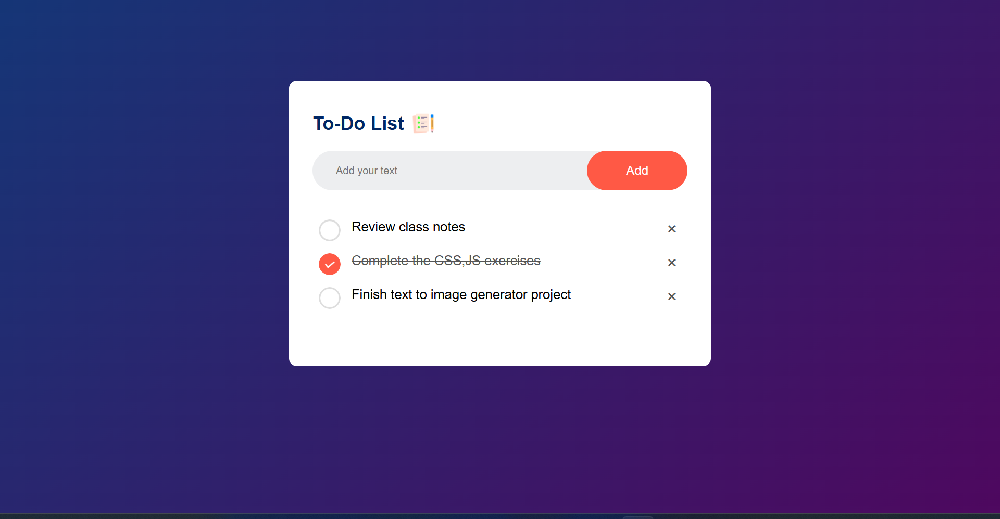

# 📝 To-Do List Web App

A clean and minimalistic To-Do List web app built using **HTML, CSS, and JavaScript**. Easily add, check off, and delete tasks to manage your daily goals and productivity.



---

## 🔧 Features

- ✅ Add tasks to your list
- ✔️ Mark tasks as completed
- ❌ Remove tasks from the list
- 🎨 Clean, modern UI with responsive design
- 💾 Tasks are stored temporarily (non-persistent)

---

## 🚀 Getting Started

 1. Clone the Repository
``` 
git clone https://github.com/SaiReshmithaP/To-Do-List.git
cd To-Do-List
```

 2. Using Live Server
Right-click on index.html → Open with Live Server

---

## 📁 Project Structure
```
To-Do-List/
│
├── index.html         # Main HTML file
├── style.css          # Styling (CSS)
├── script.js          # Interactivity (JavaScript)
└── README.md          # Project documentation

```
